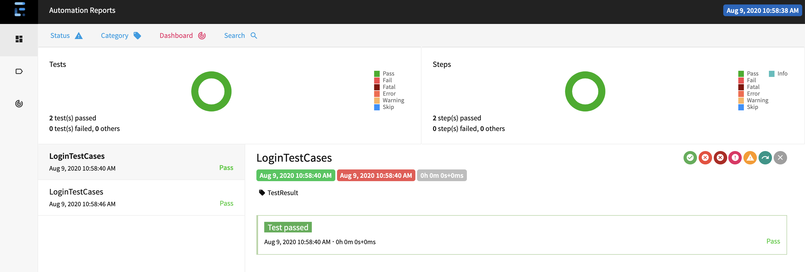
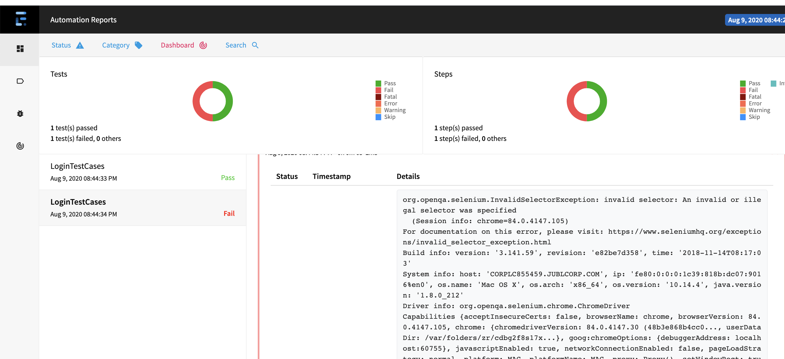

# Selenium-POM-Java Framework

Selenium page object framework with java &amp; Maven &amp; TestNG 

## Steps to Setup

**1. Clone the application**

```bash
git clone 
```

**2. Import project in any Editor(Eclispe/Intellij)**

**3. Run test.xml**


## Project Structure
### Package & Classes Details 

##### actionHelper : In this package common web functions is present

```bash
WebActionHelperMethods : All the common web functions is present in this class like click(),Scroll(),Enter() etc.
```
##### driverManager : In this package We are handling drivers initialization on the basis of browser 

```bash
DriverManagerType : We have create an enum for Driver types and its definations
```
```bash
Webdrivers : In this class we are creating driver object on the Basis of DriverType  like DriverManagerType.CHROME,DriverManagerType.firefoxdriver
```
##### listners : In this package we are using TestNg ITestlistner for creating report on the basis of Test result

```bash
TestListner :In this class we have implement ITestlistner provided 
```
##### reportManager : In this package we are using Extent report for reporting testCases

```bash
ExtentManager :In this class we are using Extent api and  initialization of Extent object 
```

##### Pages : In this package all the pages of application is present.

```bash
BasePageClass :In this class we have initialize all the page classes using PagePafctory conecepts(PageFactory.initElements)
```
```bash
HomePage,Login Page :In this class we have all the locators and associated methods.
```
##### TestCases : In this package all the TestCases is present.

```bash
BaseTest :In this class we have initialize drivers and all the pages.
```

##### Report






